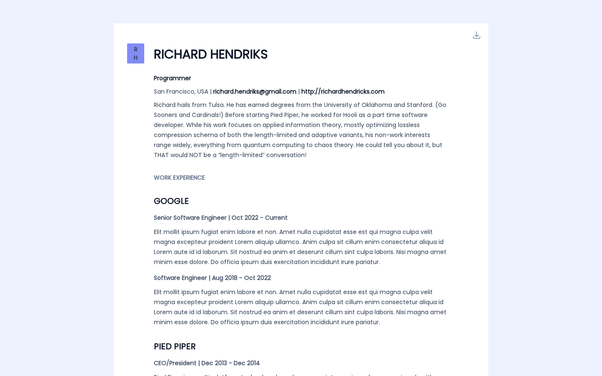
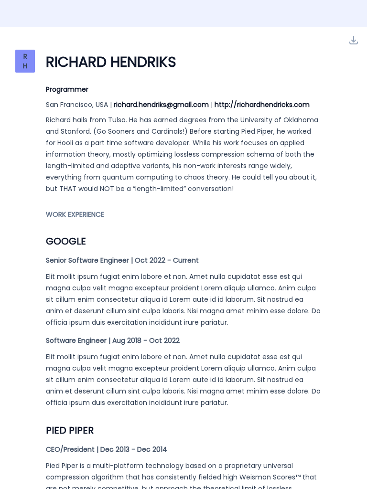
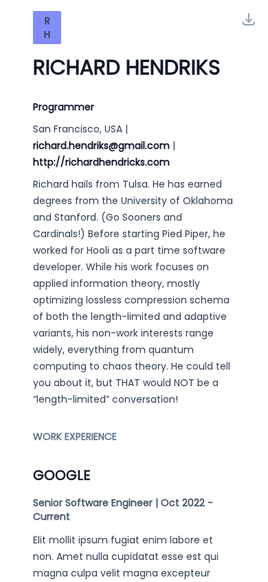
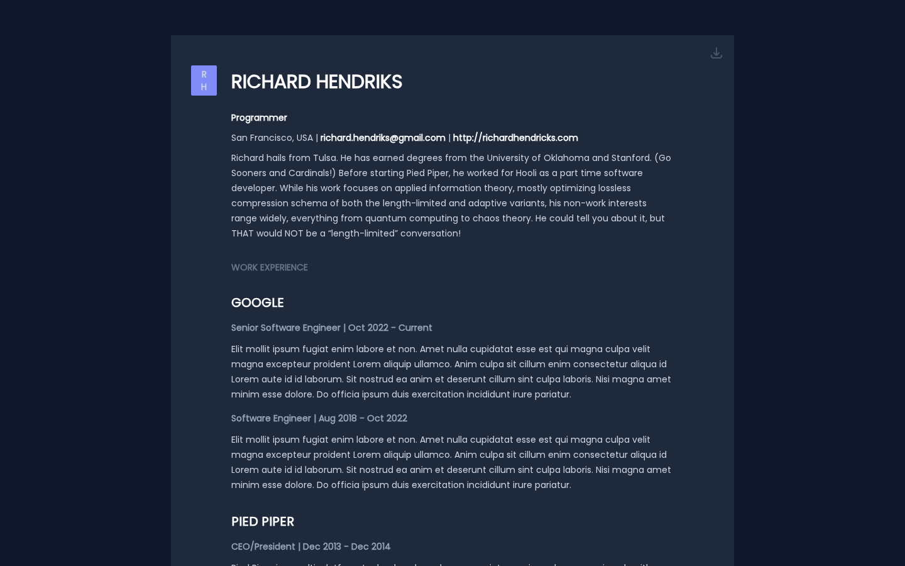
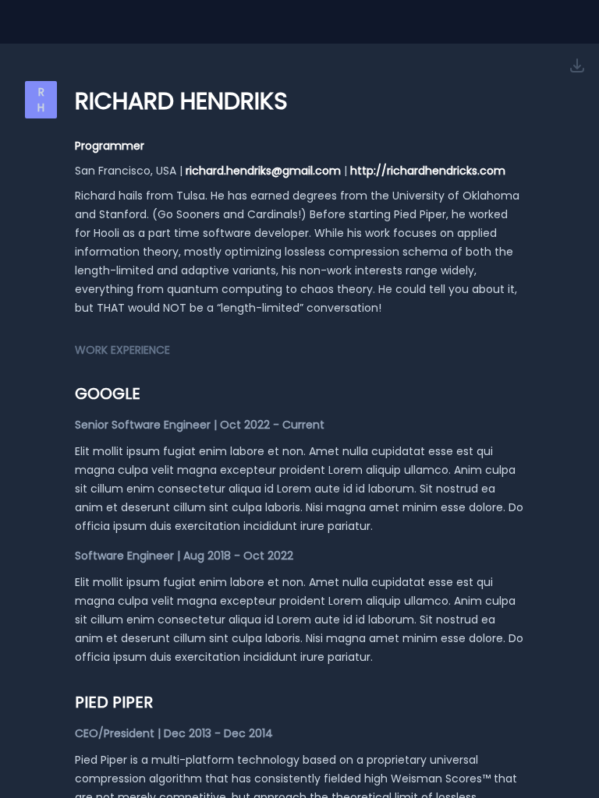
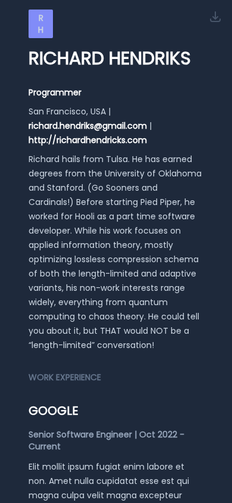

# astro-resume

> Resume builder based on [Markdown](https://www.markdownguide.org/) and [Tailwind CSS](https://tailwindcss.com/). Built with [Astro](https://astro.build/), and inspired by [Standard Resume](https://standardresume.co/).

## [Demo](https://astro-resume.netlify.app)

## Features

- Full Tailwind CSS integration with `@tailwindcss/typography` plugin
- Dark mode ready with `:dark` tag powered by Tailwind CSS
- No need for complex data structure, just write your information in Markdown!
- Resume PDF generation using [Playwright](https://playwright.dev/)
- Ready for deployment with [Netlify](https://netlify.com/) or any static website hosting.
- Fonts powered by [Fontsource](https://fontsource.org/)
- Full Typescript support

## Screenshots

Captured from the [live demo](https://astro-resume.netlify.app) with [shot-scraper](https://github.com/simonw/shot-scraper). Light and dark run as **parallel CI jobs** via [`shots-light.yml`](shots-light.yml) / [`shots-dark.yml`](shots-dark.yml), using Playwright `--color-scheme` media emulation (Tailwind `darkMode: "media"` — no theme toggle / classList). Workflow: [`.github/workflows/screenshots.yml`](.github/workflows/screenshots.yml).

### Light mode

| Desktop | Tablet | Phone |
| ------- | ------ | ----- |
|  |  |  |

### Dark mode

| Desktop | Tablet | Phone |
| ------- | ------ | ----- |
|  |  |  |

### PDF Generated

| Page 1                                                                                                              | Page 2                                                                                                              |
| ------------------------------------------------------------------------------------------------------------------- | ------------------------------------------------------------------------------------------------------------------- |
|  |  |

## Project Structure

Astro looks for `.astro` or `.md` files in the `src/pages/` directory. Each page is exposed as a route based on its file name.

There's nothing special about `src/components/`, but that's where we like to put any Astro/React/Vue/Svelte/Preact components.

Any static assets, like images, can be placed in the `public/` directory.

The pdf is generated at build time, so no need to manually generated it.

## Commands

All commands are run from the root of the project, from a terminal:

| Command             | Action                                             |
| :------------------ | :------------------------------------------------- |
| `yarn`              | Installs dependencies                              |
| `yarn dev`          | Starts local dev server at `localhost:4321`        |
| `yarn build`        | Build your production site to `./dist/`            |
| `yarn preview`      | Preview your build locally, before deploying       |
| `yarn astro ...`    | Run CLI commands like `astro add`, `astro preview` |
| `yarn astro --help` | Get help using the Astro CLI                       |

## How to setup your own resume?

- You can quickly clone this repository by clicking on [Use this template](https://github.com/EmaSuriano/astro-resume/generate).
- After your repository is created, you should modify [index.md](./src/pages/index.md) with your information.
- Once you are done, push your changes into your repository.
- Select any of the available options to deploy your websites. This project already provides the setup to deploy with Netlify, you can check [this guide](https://www.netlify.com/blog/2016/09/29/a-step-by-step-guide-deploying-on-netlify/) for more information.

## Contributing

Feel free to open issues or/and pull requests into this repository to improve it!

## License

MIT.
